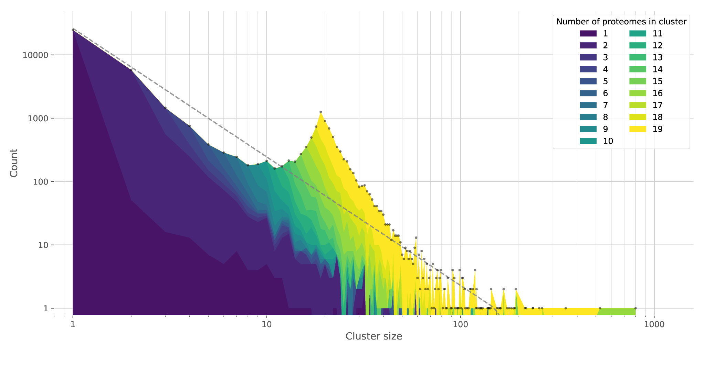

[Google Summer of Code](https://summerofcode.withgoogle.com) at the [Tree of Life](https://www.sanger.ac.uk/programme/tree-of-life/) at the [Wellcome Sanger Institute](https://www.sanger.ac.uk)

[**Accepting proposals for Google Summer of Code 2024**](https://docs.google.com/document/d/1vWnJhxWJU4oNsZNheKrP6sx5ZPkOzumwdnL6IIRbDP4)

# KinFin Integration

_**Integrating KinFin Proteome Cluster analyses into Genome Browsing environments**_

Analysing how gene families evolve is key to many large scale projects in phylogenetics and genomics. Most eukaryotic species have between 15,000 and 25,000 protein coding genes and toolkits exist to cluster these into protein families based on sequence similarity. However, interrogating these protein families across hundreds of species (and many million proteins) for patterns that reveal biological processes requires new tool development. [KinFin](https://github.com/DRL/kinfin) is one such tool that takes protein clustering derived from variants of the MCL algorithm and facilitates intensive interrogation of these. This project will update KinFin to efficiently take data from the latest versions of protein clustering toolkits such as [OrthoFinder](https://github.com/davidemms/OrthoFinder), and deliver an analysis interface to web-available genome browsing or analysis systems such as [Ensembl](https://www.ensembl.org) and [GenomeHubs](https://genomehubs.org). Much of the power of KinFin lies in its innovative visualisation approaches, and development of additional visualisations and analytic outputs will be part of the project.

<figure>
    
    <figcaption>KinFin plot of frequencies of protein clusters from 19 species. The peak at a cluster size of ~19 identifies the likely set of one-to-one orthologues in the analysed data.</figcaption>
</figure>

## GenomeHubs integration

[KinFin](https://github.com/DRL/kinfin) will be integrated into the [GenomeHubs](https://genomehubs.org) toolkit. GenomeHubs is a search-oriented collection of tools interactive genomic data exploration, including [Genomes on a Tree (GoaT)](https://goat.genomehubs.org), an [Elasticsearch](https://www.elastic.co/elasticsearch)-based datastore, search engine, and reporting platform, with directly-measured or estimated values for a suite of attributes across all known species. We have extended this approach to include data on assembly features in [BoaT](https://boat.genomehubs.org), which has a emphasis on using [BUSCO](https://busco.ezlab.org) loci to allow compararison across assemblies. As we are currently working to include synteny, orthology and gene tree data, integrating KinFin will provide a powerful analysis and visualisation feautures to a system that holds many of the data required by the existing standalone tool.

### Refactoring KinFin

This project will develop a fork of [KinFin](https://github.com/DRL/kinfin) with the aim of refactoring the output code, in particular to make it more compatible with web-based systems. A single KinFin run currently generates a large number of static images and files. A goal of this project is to refactor the code to produce JSON output files that can be rendered in a web-based system. A pull request will be submitted to the main repository once the refactoring is complete.

### KinFin as a Service

A second goal of this project is to develop a KinFin as a Service (KaaS) system. This will allow users to upload their own data to be processed by KinFin, and then to download the results. This will allow users to run KinFin on their own data without having to install the software and will provide the backend to support the GenomeHubs integration. In practice, GenomeHubs integration only requires a subset of the full functionality to be made available in this way so KaaS features will be prioritised accordingly.

### API integration

Core functionality will be made accessible to GenomeHubs sites via the [GenomeHubs API](https://github.com/genomehubs/genomehubs/tree/main/src/genomehubs-api).

### Visualisation

KinFin plots will be implemented as interactive React components within the [GenomeHubs UI](https://github.com/genomehubs/genomehubs/tree/main/src/genomehubs-ui). This will allow [taxon set based Kinfin analyses](https://kinfin.readme.io/docs/analysis-based-on-taxonomy-1) to be run based on queries and selections in GenomeHubs sites such as [BoaT](https://boat.genomehubs.org) and for the results to be linked to individual features and collections of features in other data displays. This aspect of the project offers scope for development of novel visualisations to help users gain further insight into the presented data.

## Contributing

We are proposing the GoaT-NLP project as a Google Summer of Code project for 2024. If you are interested in contributing to GoaT-NLP, please read the information provided in the [ToL+PaM GSoC 2024 Google Doc](https://docs.google.com/document/d/1vWnJhxWJU4oNsZNheKrP6sx5ZPkOzumwdnL6IIRbDP4) and use the information in that document to get in touch with any questions you may have.

### Proposals

We will assess applications from potential GSoC contributors on the basis of the proposal. Again, see the [ToL+PaM GSoC 2024 Google Doc](https://docs.google.com/document/d/1vWnJhxWJU4oNsZNheKrP6sx5ZPkOzumwdnL6IIRbDP4) for more, but broadly, we want to know:

- how would you approach this project?
- which technologies would you use and why?
- what would be the key milestones and when would you reach them?
- how would you ensure the sustainability of your code beyond the end of the GSoC term?

## Resources

- [KinFin codebase](https://github.com/DRL/kinfin)
- [KinFin documentation](https://kinfin.readme.io/docs/what-is-this-about)
- [KinFin paper](https://academic.oup.com/g3journal/article/7/10/3349/6027482)
- [OrthoFinder paper](https://genomebiology.biomedcentral.com/articles/10.1186/s13059-019-1832-y)
- [GenomeHubs codebase](https://github.com/genomehubs/genomehubs)
- [GoaT website](https://goat.genomehubs.org)
- [GoaT paper](https://wellcomeopenresearch.org/articles/8-24)
- [BoaT website](https://boat.genomehubs.org)
- [Tree of Life](https://www.sanger.ac.uk/programme/tree-of-life/)
- [Earth BioGenome Project](https://www.earthbiogenome.org)
- [Google Summer of Code](https://summerofcode.withgoogle.com)
- [ToL+PaM GSoC 2024 Google Doc](https://docs.google.com/document/d/1vWnJhxWJU4oNsZNheKrP6sx5ZPkOzumwdnL6IIRbDP4)
